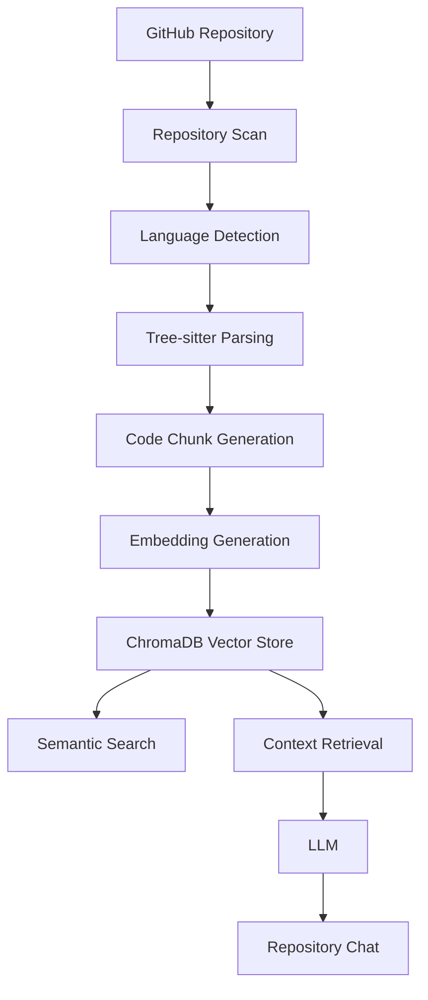

# EDITH

> **AI-Powered Repository Intelligence Platform**
>
> Understand, explore, search, and chat with codebases using semantic retrieval and Retrieval-Augmented Generation (RAG).

EDITH transforms GitHub repositories into structured, searchable knowledge bases, enabling developers to navigate unfamiliar codebases, discover functionality, perform semantic search, and ask natural language questions about repository architecture and implementation details.

---

## Why EDITH?

Understanding an unfamiliar codebase is one of the most time-consuming tasks in software development.

Developers often spend hours navigating files, tracing function calls, searching documentation, and manually piecing together system architecture before becoming productive.

EDITH accelerates repository onboarding by combining:

* Repository parsing
* Semantic code search
* Vector embeddings
* Retrieval-Augmented Generation (RAG)
* Natural language repository interactions

into a unified developer experience.

Whether you're joining a new team, exploring an open-source project, or auditing a large repository, EDITH helps you understand code faster.

---

## Key Features

### Repository Analysis

* Clone and analyze public GitHub repositories
* Automatic repository indexing pipeline
* Source file discovery and language detection
* Metadata extraction for repository understanding

### Intelligent Code Parsing

* Python parsing via Tree-sitter
* JavaScript parsing via Tree-sitter
* Extraction of:

  * Classes
  * Functions
  * Methods
  * File metadata
  * Source locations

### Semantic Search

Search code using natural language instead of exact keywords.

Example queries:

```text
authentication middleware
```

```text
repository ingestion pipeline
```

```text
vector database initialization
```

EDITH retrieves relevant code entities using vector similarity search and semantic understanding.

### Repository Explorer

Explore repository structure through an interactive interface:

* Folder hierarchy
* Files
* Classes
* Functions
* Extracted entities

Designed to provide a high-level understanding of repository organization.

### Repository Chat

Ask questions about repositories in plain English:

```text
How does authentication work?
```

```text
Which function generates embeddings?
```

```text
Explain the architecture of this project.
```

EDITH retrieves relevant context from indexed code and generates repository-aware responses through a Retrieval-Augmented Generation pipeline.

---

## Architecture



---

## Tech Stack

### Frontend

* React
* TypeScript
* Vite
* Zustand
* Tailwind CSS

### Backend

* FastAPI
* SQLAlchemy
* PostgreSQL

### AI & Retrieval

* ChromaDB
* Ollama
* Nomic Embed Text
* Retrieval-Augmented Generation (RAG)

### Code Parsing

* Tree-sitter Python
* Tree-sitter JavaScript

### Infrastructure

* Docker
* Docker Compose

---

## Workflow

1. User submits a GitHub repository.
2. EDITH clones and scans the repository.
3. Source files are parsed using Tree-sitter.
4. Classes, functions, and metadata are extracted.
5. Code entities are converted into semantic chunks.
6. Embeddings are generated using Nomic Embed Text.
7. Vectors are stored in ChromaDB.
8. Users can:

   * Explore repository structure
   * Perform semantic search
   * Chat with the repository

---

## Example Use Cases

### Repository Onboarding

Understand a new repository without manually traversing hundreds of files.

### Open Source Exploration

Quickly discover how unfamiliar projects are structured.

### Developer Productivity

Locate implementation details using natural language instead of keyword-based searches.

### Architecture Discovery

Understand relationships between modules, services, and key components.

---

## Roadmap

### Completed

* Repository ingestion
* Repository indexing
* Tree-sitter parsing
* Semantic chunk generation
* Embedding generation
* Vector storage
* Semantic search
* Repository chat
* Repository explorer

### In Progress

* Source code viewer
* Entity-to-code navigation
* Repository statistics API

### Planned

* TypeScript parser
* Multi-language support
* Cross-file dependency analysis
* Call graph generation
* Go-to-definition support
* Multi-repository search
* Advanced repository insights

---

## Screenshots

### Repository Explorer

[Add Screenshot]

### Semantic Search

[Add Screenshot]

### Repository Chat

[Add Screenshot]

---

## Running Locally

```bash
git clone <repository-url>
cd edith

docker compose up --build
```

Frontend:

```bash
http://localhost:5173
```

Backend:

```bash
http://localhost:8000
```

---

## Future Vision

EDITH is evolving from a repository search tool into a comprehensive repository intelligence platform focused on helping developers understand, navigate, and reason about large codebases.

The long-term goal is to make codebases as searchable and explorable as documents.

---

## Author

**Ayush Varun**

B.Tech Chemical Engineering, IIT Indore

Interested in AI Systems, Developer Tooling, Repository Intelligence, Retrieval-Augmented Generation, and Machine Learning.
